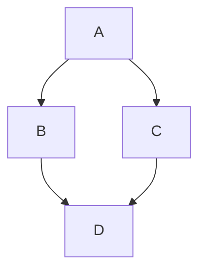

# 个人维基网站 (Personal Wiki Site)

这是一个基于 React, Vite 和 Tailwind CSS 构建的个人知识库和作品集网站。设计目标是易于部署到 GitHub Pages，并提供类似 GitBook 的阅读体验。

## 功能特点

-   **维基系统**: 支持无限层级的文档结构，自动生成侧边栏导航。
-   **Markdown 支持**: 使用 Markdown 编写内容，支持代码高亮、GFM 语法和原生 HTML。
-   **数学公式支持**: 集成 KaTeX，支持 LaTeX 数学公式（行内 `$`, `\(` 和 行间 `$$`, `\[`）。
-   **图表与可视化**: 
    -   **Mermaid**: 支持流程图、时序图等 (`mermaid` 代码块)。
    -   **Python 绘图**: 支持直接运行 Python 代码绘图 (`python:plot` 代码块，使用 `matplotlib`)。
-   **代码增强**: 代码块支持语法高亮、一键复制，行内代码优化样式。
-   **目录导航 (TOC)**: 自动生成当前页面的右侧/文内目录。
-   **侧边栏导航**: 支持折叠/展开的侧边栏，自动定位当前页面。
-   **深色/浅色模式**: 跟随系统设置自动切换，也支持手动切换。
-   **响应式设计**: 适配移动端和桌面端。
-   **GitHub Pages 部署**: 预配置了部署脚本，一键发布。
-   **结构验证**: 构建时检查文件编号与层级结构的一致性（支持非编号文件夹存放资源）。

## 技术栈

-   **框架**: React 18 + Vite
-   **语言**: TypeScript
-   **样式**: Tailwind CSS + Tailwind Typography
-   **路由**: React Router DOM v6
-   **Markdown**: react-markdown, remark-gfm, remark-math, rehype-raw, rehype-highlight, rehype-katex
-   **图标**: Lucide React

## 项目结构

```
personal-wiki-site/
├── docs/
│   └── wiki/            # [核心] 你的 Markdown 文档放在这里
│       ├── 1.离散数学/
│       │   ├── index.md # 对应 "1.离散数学" 页面
│       │   ├── 1.1.数理逻辑/
│       │   │   └── index.md # 对应 "1.1.数理逻辑" 页面
│       │   └── ...
├── src/
│   ├── components/      # UI 组件
│   ├── data/
│   │   └── wikiData.ts  # 自动读取 docs/wiki/ 下的 md 文件并生成路由数据
│   ├── pages/           # 页面组件
│   └── ...
├── ...
```

## 如何添加内容

1.  **文件夹结构**: 在 `docs/wiki/` 下创建文件夹，文件夹名称必须包含编号（如 `1.离散数学`）。
2.  **内容文件**: 在每个文件夹内创建 `index.md` 作为该章节的内容。
3.  **编号规则**: 
    -   内容文件夹名称必须以数字编号开头（如 `1.1.数理逻辑`）。
    -   子文件夹的编号必须是父文件夹编号的延伸（如 `1.1` 的子文件夹必须是 `1.1.x`）。
    -   非内容文件夹（如 `assets`, `images`）不需要编号，验证脚本会忽略它们。
4.  **标题显示**: 页面标题会自动根据路径生成，格式为 `祖先1 - 祖先2 - 相对编号.标题`。

## 写作规范指南

### 1. 标题层级
由于页面标题（H1）由系统自动生成，**文档内容请从二级标题 (`##`) 开始**。

### 2. 数学公式
-   **行内公式**: 使用 `$` 包裹，例如 `$E=mc^2$`。
-   **行间公式**: 使用 `$$` 包裹，例如：
    ```latex
    $$
    \int_{-\infty}^{\infty} e^{-x^2} dx = \sqrt{\pi}
    $$
    ```

### 3. 图片插入
将图片放入同级或子级的 `assets` 文件夹中，使用相对路径引用：
```markdown

```

### 4. 图表 (Mermaid)
使用 `mermaid` 语言标记的代码块：
````markdown

````

### 5. Python 绘图
使用 `python:plot` 语言标记的代码块。
-   **必须**包含 `import matplotlib.pyplot as plt`。
-   **必须**使用 `plt.show()` 来显示图表。
-   **不要**使用 `plt.savefig()`。
-   **避免**在图表中使用中文字符（除非配置了字体），否则可能显示乱码。

````markdown
```python:plot
import matplotlib.pyplot as plt
import numpy as np

x = np.linspace(0, 10, 100)
y = np.sin(x)

plt.plot(x, y)
plt.title("Sine Wave")
plt.show()
```
````

## 开发与部署

1.  **安装依赖**
    ```bash
    pnpm install
    ```

2.  **启动开发服务器**
    ```bash
    pnpm dev
    ```

3.  **构建与部署**
    本项目使用 `gh-pages` 分支进行部署。
    *   **main 分支**: 存放源代码。
    *   **gh-pages 分支**: 存放构建后的静态文件（由脚本自动生成）。

    **部署步骤**:
    ```bash
    pnpm run deploy
    ```
    此命令会自动执行构建 (`pnpm build`) 并将 `dist` 目录推送到 `gh-pages` 分支。

## 常见问题

### 为什么有两个分支？
-   `main`: 是你的**源码**，包含 React 组件、TypeScript 代码和原始 Markdown 文档。你应该在这里进行所有的编辑和提交。
-   `gh-pages`: 是**发布代码**，包含经过 Vite 编译、压缩后的 HTML/CSS/JS 文件。浏览器只能运行这些编译后的代码。你**不需要**手动修改这个分支，部署脚本会处理一切。

### 为什么 gh-pages 文件很少？
因为它只包含编译后的产物（通常是一个 `index.html` 和 `assets` 文件夹），源码中的 TypeScript、React 组件等都被打包成了浏览器可识别的最小化 JavaScript 文件。

## 提示词

```text
你是一个专业的学术内容整理助手。请根据我提供的资料，为我生成一篇知识总结。

请严格遵守以下格式规范：

1.  **标题层级**：
    *   文档内容从 **一级标题 (#)** 开始结构化，标题为章节名。
    *   从 **二级标题 (##)** 开始，依照鲜明的层次等级，可以到三级标题，尽可能不要到四级标题。标号以点“.”结尾，不要省略，如“1.1.”、“2.3.4.”。

2.  **数学公式**：
    *   **行内公式**：必须使用单美元符号包裹，例如 `$E=mc^2$`。
    *   **行间公式**：必须使用双美元符号，在上一行和下一行进行包裹，例如：
    ```markdown
    $$
    \sum_{i=1}^n i = \frac{n(n+1)}{2}
    $$
    ```
    *   请使用标准的 LaTeX 语法。

3.  **代码与图表**：
    *   **通用代码**：使用标准 Markdown 代码块，如 `python`, `cpp`, `ts` 等。
    *   **流程图/UML**：使用 `mermaid` 代码块。
    *   **Python 绘图**：如果需要展示函数图像或数据可视化，请使用 `python:plot` 代码块。
        *   必须导入 `import matplotlib.pyplot as plt`。
        *   必须使用 `plt.show()` 结尾来显示图像。
        *   **严禁**使用 `plt.savefig()`。
        *   图表中的标题和标签请使用**英文**，避免中文字体缺失导致乱码。

4.  **图片引用**（如果需要）：
    *   假设图片存储在同级目录下。
    *   格式：``。

5.  **内容风格**：
    *   结构清晰，逻辑严密。
    *   重点内容可以使用 **加粗**。
    *   适当使用列表和引用块。

请根据以上规范，总结以下内容：
[在此处粘贴你的课件或知识点]
```