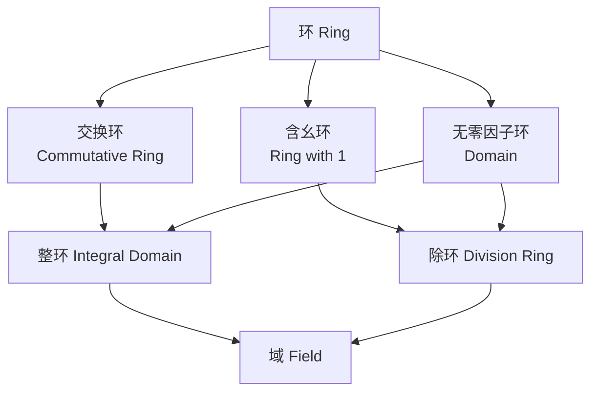

# 第三章 环与域

> 本章内容基于抽象代数标准理论整理，与前两章群论内容有机衔接。环是同时具备加法和乘法两种运算的代数结构，而域是环的特殊情形（满足乘法交换律且非零元均可逆）。考虑到环中同时存在两种运算，本章将沿用类似第一章的结构——从基本定义出发，依次介绍子环和理想、环同态，最后引出整环、域等特殊环类，并将群论中的同态基本定理类比推广到环的语境中。

## 3.1. 环的基本概念

### 3.1.1. 环的定义

环（Ring）是一类包含两种运算（加法和乘法）的代数系统，是现代代数学十分重要的一类研究对象。在群论中，我们讨论的是仅有一种二元运算的代数结构；而环则同时涉及两种运算，并通过分配律将它们联系起来。

**定义 3.1.1** 设 $R$ 是非空集合，在 $R$ 上定义加法“$+$”和乘法“$\cdot$”两种二元运算。若满足以下三个条件，则称代数系统 $(R, +, \cdot)$ 是一个**环**：

1. $(R, +)$ 是交换群（阿贝尔群），即：
   - 加法结合律：$(a+b)+c = a+(b+c)$；
   - 加法交换律：$a+b = b+a$；
   - 存在加法单位元 $0$，使得 $a+0 = 0+a = a$；
   - 每个元素 $a$ 有加法逆元 $-a$，使得 $a+(-a)=(-a)+a=0$。

2. $(R, \cdot)$ 是半群，即乘法满足结合律：$(ab)c = a(bc)$。

3. **乘法对加法的分配律**成立：$\forall a, b, c \in R$，
   $$
   a \cdot (b+c) = a \cdot b + a \cdot c, \quad (a+b) \cdot c = a \cdot c + b \cdot c.
   $$

通常将 $0$ 称为环中的加法单位元（零元），$a$ 的加法逆元记为 $-a$。若环中乘法存在单位元，则用 $1$ 表示，称为环的单位元（幺元）。

### 3.1.2. 环的基本性质

**定理 3.1.1** 设 $(R, +, \cdot)$ 是一个环，则对任意 $a, b \in R$，有：

1. $a \cdot 0 = 0 \cdot a = 0$。
2. $a \cdot (-b) = (-a) \cdot b = -(ab)$。
3. $(-a) \cdot (-b) = ab$。

**证明**：利用分配律和加法逆元的性质即可得证。例如，
$$
a \cdot 0 = a \cdot (0+0) = a \cdot 0 + a \cdot 0,
$$
由加法消去律可得 $a \cdot 0 = 0$。类似可证 $0 \cdot a = 0$。 $\square$

### 3.1.3. 环的类型与常见例子

**常见环的例子**：

1. **整数环 $(\mathbb{Z}, +, \times)$**：整数集合关于普通加法和乘法构成环，称为整数环。
2. **有理数环 $(\mathbb{Q}, +, \times)$**、**实数环 $(\mathbb{R}, +, \times)$**、**复数环 $(\mathbb{C}, +, \times)$**：均关于数的加法和乘法构成环。
3. **矩阵环 $(M_n(\mathbb{R}), +, \times)$**：$n$ 阶实矩阵集合关于矩阵加法和乘法构成环。
4. **多项式环 $\mathbb{R}[x]$**：实数系数多项式的集合关于多项式加法和乘法构成环。
5. **模 $n$ 剩余类环 $(\mathbb{Z}_n, \oplus, \otimes)$**：$\mathbb{Z}_n = \{\bar{0}, \bar{1}, \dots, \overline{n-1}\}$ 关于模 $n$ 加法和乘法构成环，称为剩余类环。

在群论中，我们熟悉了循环群 $\mathbb{Z}_n$ 的加法结构，而剩余类环 $\mathbb{Z}_n$ 则是在此基础上增加了模 $n$ 乘法运算——这正是从群到环的自然过渡。

**定义 3.1.2**（交换环） 设 $(R, +, \cdot)$ 是环。若乘法 $\cdot$ 满足交换律（$\forall a, b \in R, ab = ba$），则称 $R$ 是**交换环**。否则称为**非交换环**。

**定义 3.1.3**（含幺环） 设 $(R, +, \cdot)$ 是环。若乘法 $\cdot$ 存在单位元 $1$（即 $\forall a \in R, a \cdot 1 = 1 \cdot a = a$），则称 $R$ 是**含幺环**（或**有单位元的环**）。

**注意**：含幺环中必须要求 $1 \neq 0$，否则环退化为仅有一个元素的平凡环（即 $\{0\}$）。

**示例对比**：
- 整数环 $\mathbb{Z}$ 既是交换环又是含幺环（单位元为 $1$）。
- 矩阵环 $M_n(\mathbb{R})$（$n \ge 2$）是含幺环（单位元为单位矩阵），但**不是交换环**。
- 偶数集 $2\mathbb{Z}$ 是整数环的子环，但**不是含幺环**（没有乘法单位元）。

---

## 3.2. 子环、理想与商环

### 3.2.1. 子环

**定义 3.2.1** 设 $(R, +, \cdot)$ 是一个环，$S$ 是 $R$ 的非空子集。若 $S$ 关于 $R$ 的加法和乘法运算也构成一个环，则称 $S$ 为环 $R$ 的**子环**。

**定理 3.2.1（子环判别法）** 设 $R$ 是环，$S \subseteq R$ 是非空子集。则 $S$ 是 $R$ 的子环当且仅当对任意 $a, b \in S$，有：
1. $a - b \in S$（加法封闭）；
2. $ab \in S$（乘法封闭）。

**说明**：条件 $a - b \in S$ 等价于加法子群的判别条件，它巧妙地将零元、加法逆元的存在性以及加法封闭性统一起来。

**子环的例子**：
- 偶数集 $2\mathbb{Z}$ 是整数环 $\mathbb{Z}$ 的子环。
- 整数环 $\mathbb{Z}$ 是有理数环 $\mathbb{Q}$ 的子环。
- 上三角矩阵的集合是矩阵环 $M_n(\mathbb{R})$ 的子环。

### 3.2.2. 理想

理想（Ideal）在环论中的地位类似于正规子群在群论中的地位——它是为了构造商环而引入的关键概念。

**定义 3.2.2** 设 $(R, +, \cdot)$ 是一个环，$I$ 是 $R$ 的一个加法子群（即满足 $a-b \in I$）。若对任意的 $a \in I$，$r \in R$，都有 $ra \in I$，则称 $I$ 是 $R$ 的一个**左理想**；若都有 $ar \in I$，则称 $I$ 是 **右理想**。若 $I$ 同时是左理想和右理想，则称 $I$ 是 $R$ 的一个**理想**（Ideal），记作 $I \triangleleft R$。

**直观理解**：理想是一个“乘法黑洞”——用环中任意元素去乘理想中的元素，结果仍然落回理想中。

**判别条件**：$I$ 是 $R$ 的理想当且仅当：
1. $0 \in I$；
2. $\forall i, j \in I$，$i - j \in I$（$I$ 是加法子群）；
3. $\forall i \in I, r \in R$，$ri \in I$ 且 $ir \in I$（吸收性）。

**理想的例子**：
- 任何环 $R$ 至少有两个理想：$\{0\}$ 和 $R$ 本身，称为**平凡理想**。
- 整数环 $\mathbb{Z}$ 中，集合 $n\mathbb{Z} = \{nk \mid k \in \mathbb{Z}\}$ 是 $\mathbb{Z}$ 的理想（$n$ 为任一整数）。
- 多项式环 $\mathbb{R}[x]$ 中，所有常数项为零的多项式构成的集合是理想。

**重要概念**：
- **真理想**：若 $I \subsetneq R$，则称 $I$ 是 $R$ 的真理想。
- **极大理想**：若 $I$ 是真理想，且不存在真理想 $J$ 满足 $I \subsetneq J \subsetneq R$，则称 $I$ 是极大理想。
- **素理想**：若对任意 $a, b \in R$，$ab \in I$ 蕴含 $a \in I$ 或 $b \in I$，则称 $I$ 是素理想。

值得注意的是，在群论中，正规子群 $H$ 满足 $gH = Hg$；而理想 $I$ 满足更强的吸收性条件 $rI = Ir = I$（作为集合相等），两者虽然地位类似，但条件有所不同。

### 3.2.3. 商环

利用理想可以构造商环，这是环类比于群中利用正规子群构造商群的推广。

**定理 3.2.2** 设 $I$ 是环 $R$ 的一个理想。令
$$
R/I = \{a + I \mid a \in R\},
$$
其中 $a + I = \{a + i \mid i \in I\}$ 是 $I$ 的陪集。在 $R/I$ 上定义加法和乘法如下：
$$
(a + I) + (b + I) = (a + b) + I, \quad (a + I)(b + I) = ab + I,
$$
则 $R/I$ 关于这两种运算构成一个环，称为 $R$ 关于 $I$ 的**商环**（也称剩余类环）。

**示例**：模 $n$ 剩余类环 $\mathbb{Z}_n$ 就是整数环 $\mathbb{Z}$ 关于理想 $n\mathbb{Z}$ 的商环。这与群论中循环群 $\mathbb{Z}_n$ 可以视作 $\mathbb{Z}$ 关于子群 $n\mathbb{Z}$ 的商群是一脉相承的。

---

## 3.3. 环的同态与同态基本定理

### 3.3.1. 环同态的定义

**定义 3.3.1** 设 $(R, +, \cdot)$ 和 $(S, \oplus, \otimes)$ 是两个环，$f: R \to S$ 是一个映射。若对任意 $a, b \in R$，有
1. $f(a + b) = f(a) \oplus f(b)$（保持加法）；
2. $f(ab) = f(a) \otimes f(b)$（保持乘法），
则称 $f$ 是 $R$ 到 $S$ 的**环同态映射**，简称**环同态**。若 $f$ 是单射、满射、双射，则分别称为**单同态**、**满同态**和**同构**。

### 3.3.2. 环同态的基本性质

**定理 3.3.1** 设 $f: R \to S$ 是环同态，则：
1. $f(0_R) = 0_S$（零元的象是零元）；
2. $f(-a) = -f(a)$（加法逆元的象是象的加法逆元）；
3. 若 $R$ 是含幺环（单位元 $1_R$），则 $f(1_R)$ 是 $S$ 中 $f(R)$ 的单位元。若 $f$ 是满射，则 $f(1_R)$ 是 $S$ 的单位元。

### 3.3.3. 环同态的核

**定义 3.3.2** 设 $f: R \to S$ 是环同态。令
$$
\ker f = \{a \in R \mid f(a) = 0_S\},
$$
称为环同态 $f$ 的**核**。

**定理 3.3.2** 设 $f: R \to S$ 是环同态。则 $\ker f$ 是 $R$ 的一个理想。

**证明**：$\ker f$ 是 $R$ 的加法子群，且对任意 $r \in R$，$k \in \ker f$，有
$$
f(rk) = f(r)f(k) = f(r) \cdot 0 = 0,
$$
故 $rk \in \ker f$。同理 $kr \in \ker f$。 $\square$

**注意**：核是理想的这一事实，与群论中核是正规子群形成完美类比——在群论中核是正规子群，在环论中核是理想。

### 3.3.4. 环的同态基本定理

**定理 3.3.3（环的同态基本定理，亦称第一同构定理）** 设 $R$ 和 $S$ 是环，$f: R \to S$ 是环满同态，则
$$
R / \ker f \cong S.
$$
即 $R$ 关于核的商环与 $S$ 同构。

**推论**：将群论中的第一同构定理中的“群”换为“环”，“子群”换为“子环”，“正规子群”换为“理想”，“商群”换为“商环”，即得环的同构基本定理。

---

## 3.4. 零因子、整环与除环

### 3.4.1. 零因子

**定义 3.4.1** 设 $R$ 是环，$a, b \in R$，$a \neq 0$，$b \neq 0$，但 $ab = 0$，则称 $a$ 和 $b$ 是环 $R$ 的**零因子**。若一个环不含非零零因子，则称 $R$ 是 **无零因子环**。

**示例**：
- 整数环 $\mathbb{Z}$ 是无零因子环。
- 矩阵环 $M_2(\mathbb{R})$ 含有零因子。例如：
  $$
  \begin{pmatrix} 1 & 0 \\ 0 & 0 \end{pmatrix} \begin{pmatrix} 0 & 0 \\ 1 & 0 \end{pmatrix} = \begin{pmatrix} 0 & 0 \\ 0 & 0 \end{pmatrix}.
  $$
- 剩余类环 $\mathbb{Z}_6$ 中，$\bar{2} \cdot \bar{3} = \bar{0}$，故 $\bar{2}$ 和 $\bar{3}$ 是零因子。

**定理 3.4.1** 环 $R$ 是无零因子环当且仅当乘法消去律成立，即：
$$
\forall a, b, c \in R, a \neq 0, \text{ 若 } ab = ac, \text{ 则 } b = c.
$$

**证明**：若 $R$ 无零因子且 $ab = ac$，则 $a(b-c) = 0$，由 $a \neq 0$ 得 $b-c=0$，即 $b = c$。反之亦然。

### 3.4.2. 整环

**定义 3.4.2** 设 $R$ 是一个交换环，含乘法单位元 $1 \neq 0$，且 $R$ 无零因子，则称 $R$ 是一个**整环**（Integral Domain）。

**示例**：
- 整数环 $\mathbb{Z}$ 是整环。
- 多项式环 $\mathbb{R}[x]$ 是整环。
- 模 $n$ 剩余类环 $\mathbb{Z}_n$ 是整环当且仅当 $n$ 是素数。因为若 $n$ 为合数，则存在非零元乘积为零的情形。

整环可以理解为“最接近整数运算性质的环”——整数的加法和乘法在整环中得到完全的抽象。

### 3.4.3. 除环

**定义 3.4.3** 设 $R$ 是含幺环，$1 \neq 0$。若 $R$ 中每个非零元都有乘法逆元，则称 $R$ 是一个**除环**（Division Ring）。

**注意**：除环不要求乘法交换律，因此除环也称为**体**。

**示例**：四元数环（Hamilton 四元数集合）是一个非交换除环。

### 3.4.4. 各种环的关系总结

下图归纳了环及其特殊类型之间的层次关系：

---

## 3.5. 域

### 3.5.1. 域的定义

域（Field）是抽象代数中最基本的代数结构之一，其深刻性在于“除法”运算可以进行——即每个非零元都有乘法逆元。

**定义 3.5.1** 设 $(F, +, \cdot)$ 是一个环，若满足：
1. $(F, +)$ 是交换群；
2. $(F \setminus \{0\}, \cdot)$ 也是交换群；
3. 乘法对加法满足分配律，
则称 $F$ 是一个**域**。

等价地说，域是 **交换除环**（乘法交换的除环）。

### 3.5.2. 域的等价刻画

**定义 3.5.2（数域角度）** 设 $F$ 是一个含有 $0$ 和 $1$ 的数集。若 $F$ 对数的四则运算（加、减、乘、除，除法中除数不为零）都封闭，则称 $F$ 是一个**数域**。

**典型域的例子**：
- **有理数域** $(\mathbb{Q}, +, \times)$：是所有数域中最小的数域。
- **实数域** $(\mathbb{R}, +, \times)$。
- **复数域** $(\mathbb{C}, +, \times)$。
- **有限域**（Galois 域）：元素个数有限的域，如 $\mathbb{Z}_p$（$p$ 为素数）。

**注意**：整数环 $\mathbb{Z}$ **不是**域，因为 $\mathbb{Z}\setminus\{0\}$ 中的元素（除了 $\pm 1$）没有乘法逆元。

### 3.5.3. 子域

**定义 3.5.3** 设 $F$ 是域，$K \subseteq F$ 是非空子集。若 $K$ 关于 $F$ 的运算也构成一个域，则称 $K$ 是 $F$ 的**子域**。

**子域的判定**：$K$ 是域 $F$ 的子域当且仅当 $K$ 是 $F$ 的子环，且对任意非零元 $a \in K$，$a^{-1} \in K$。

### 3.5.4. 域的特征

**定义 3.5.4** 设 $F$ 是一个域，$1$ 是 $F$ 的乘法单位元。考虑 $1$ 的 **加法阶**：若存在正整数 $p$ 使得
$$
\underbrace{1 + 1 + \cdots + 1}_{p \text{ 个}} = 0,
$$
则称满足该条件的最小正整数 $p$ 为域 $F$ 的**特征**（Characteristic）。若不存在这样的正整数，则称 $F$ 的特征为 $0$。

**定理 3.5.1** 若域 $F$ 的特征 $p > 0$，则 $p$ 必为素数。

**证明**：假设 $p$ 为合数，设 $p = mn$（$1 < m, n < p$），则
$$
(m \cdot 1)(n \cdot 1) = (mn) \cdot 1 = 0,
$$
由于 $m \cdot 1 \neq 0$，$n \cdot 1 \neq 0$，这与域无零因子矛盾。 $\square$

### 3.5.5. 素域

**定义 3.5.5** 不含任何真子域的域称为**素域**（Prime Field）。

**定理 3.5.2** 任何域都包含且仅包含一个素子域。根据域的特征，素域可分为两类：
- 若特征 $= 0$，则素域与有理数域 $\mathbb{Q}$ 同构；
- 若特征 $= p$（素数），则素域与有限域 $\mathbb{F}_p \cong \mathbb{Z}_p$（模 $p$ 剩余类域）同构。

**推论**：有限域的元素个数只能是素数的幂 $p^n$（$n \ge 1$）。特别地，当 $n=1$ 时，$\mathbb{Z}_p$ 是典型的 $p$ 元有限域。

群论中的 Lagrange 定理告诉我们子群的阶整除群的阶，而这里域论中的类似结论是：有限域的元素个数一定是特征值的幂次。

---

## 3.6. 域论中的几个重要概念（简介）

### 3.6.1. 分式域

**定理 3.6.1** 任何一个整环 $R$ 都可以嵌入到一个域中（即存在一个域 $F$ 和一个单同态 $\varphi: R \to F$）。这样的域 $F$ 称为 $R$ 的**分式域**，可类比于从整数环 $\mathbb{Z}$ 构造有理数域 $\mathbb{Q}$ 的过程。

### 3.6.2. 域扩张（简介）

若 $K$ 是 $F$ 的子域，则称 $F$ 是 $K$ 的一个**扩域**（或扩张）。例如复数域 $\mathbb{C}$ 是实数域 $\mathbb{R}$ 的扩域，实数域和复数域又都是有理数域 $\mathbb{Q}$ 的扩域。扩域理论是伽罗瓦理论的基础。

---

## 本章小结

本章介绍了环与域的基本理论，与前两章的群论内容形成完整的抽象代数知识体系。本章主要内容如下：

| 主题 | 核心概念 |
|------|----------|
| 环的基本概念 | 环的定义，加法交换群、乘法半群、分配律，交换环、含幺环，常见环的实例（整数环、多项环式、矩阵环、模 $n$ 剩余类环） |
| 子环与理想 | 子环的判定，理想的定义与性质（吸收性），理想与正规子群的类比 |
| 商环与环同态 | 商环的构造，环同态的定义与核，核为理想，环的同态基本定理 |
| 整环与除环 | 零因子的概念，整环（交换含幺无零因子环），除环（非零元均有逆元） |
| 域 | 域的定义（交换除环/四则运算封闭数集），典型域，子域判定，特征，素域分类 |

环与域的理论在编码理论、密码学、形式语言与自动机理论等领域有广泛应用。例如有限域 $\mathbb{F}_{p^n}$ 是 AES 加密算法的基础数学结构；多项式环与商环的构造是代数编码理论的核心工具。
