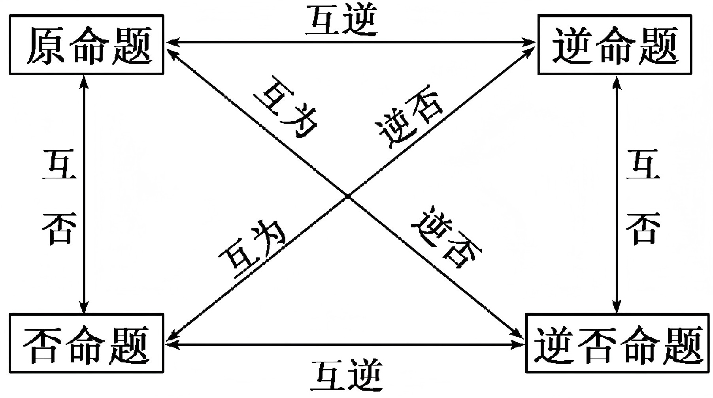
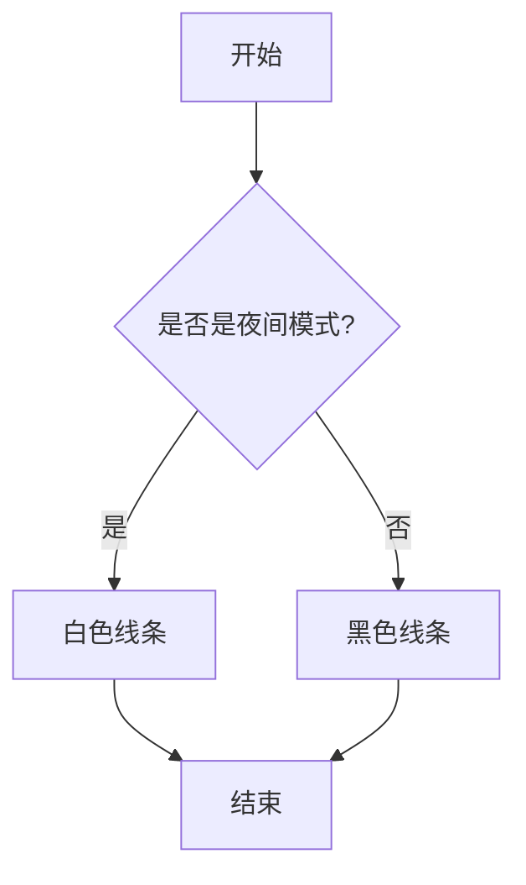
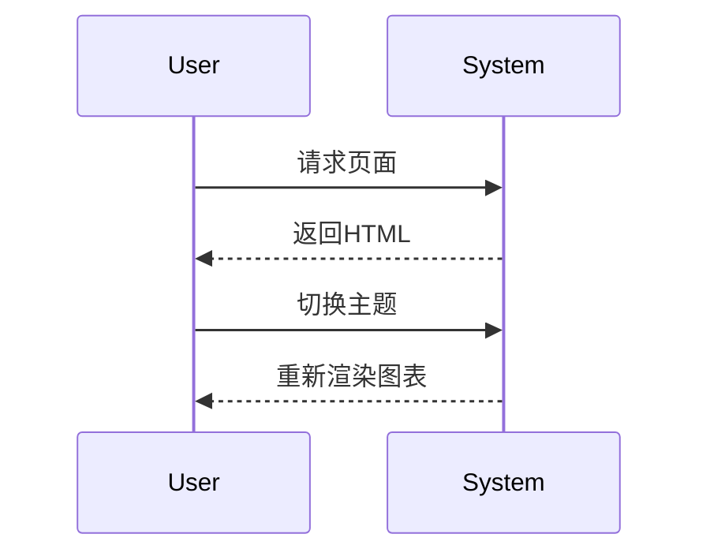

# 可视化功能测试

## 1. 相对路径图片测试

请将一张名为 `test-image.png` 的图片放入 `docs/wiki/1.离散数学/` 文件夹中。



## 2. UML 图表测试 (Mermaid)

### 流程图


### 时序图


## 3. Python 绘图测试

### 基础绘图
```python-plot
import matplotlib.pyplot as plt
import numpy as np

x = np.linspace(0, 10, 100)
y = np.sin(x)

plt.figure(figsize=(8, 4))
plt.plot(x, y, label='sin(x)')
plt.title('Sine Wave')
plt.xlabel('x')
plt.ylabel('y')
plt.grid(True, alpha=0.3)
plt.legend()
plt.show()
```

### 复杂绘图 (散点图)
```python-plot
import matplotlib.pyplot as plt
import numpy as np

# Generate random data
np.random.seed(42)
x = np.random.rand(50)
y = np.random.rand(50)
colors = np.random.rand(50)
area = (30 * np.random.rand(50))**2

plt.figure(figsize=(8, 6))
plt.scatter(x, y, s=area, c=colors, alpha=0.5)
plt.title('Random Scatter Plot')
plt.show()
```
