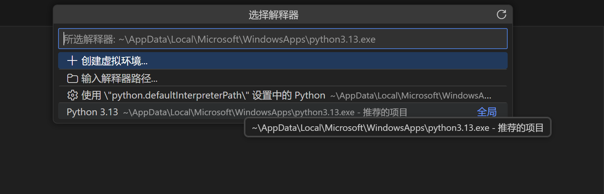
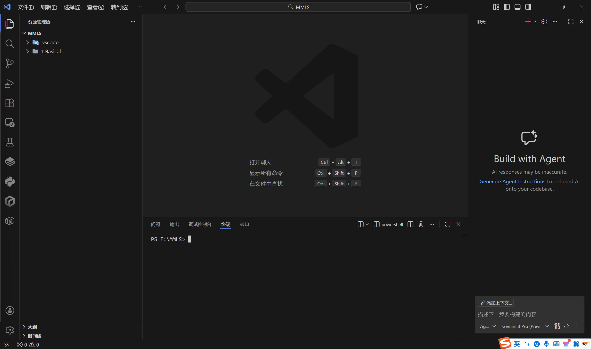
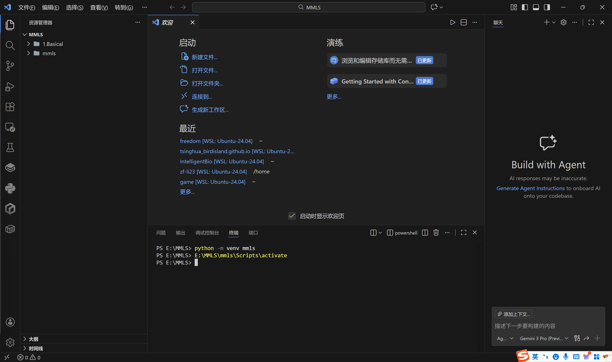
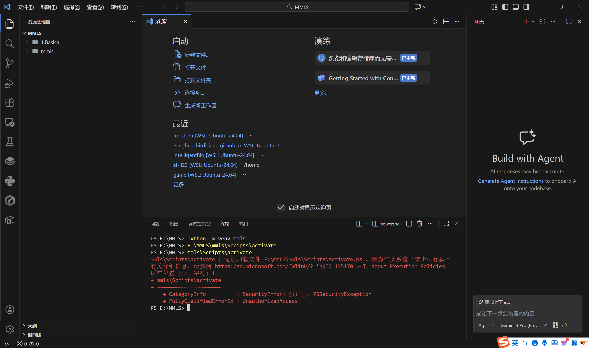
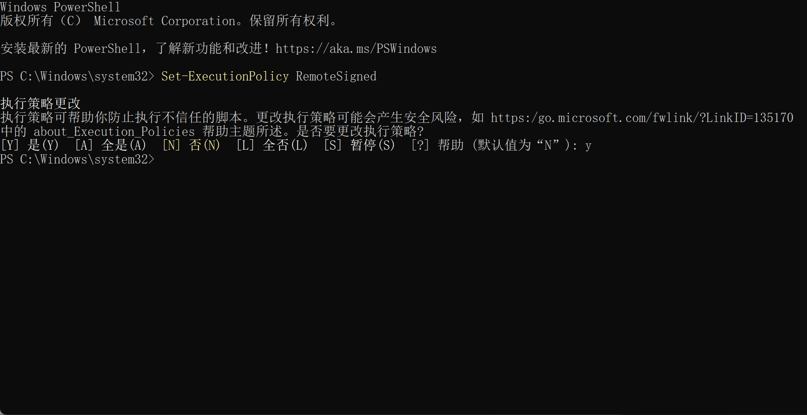
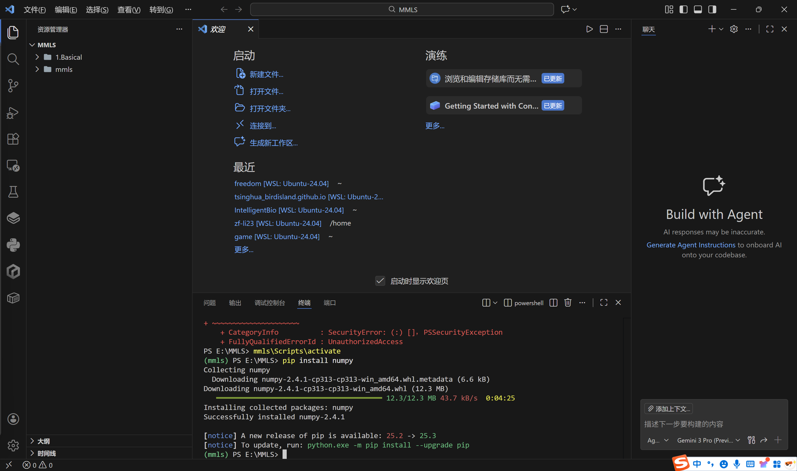

**内容**：Python科学计算栈（NumPy, SciPy）及绘图库（Matplotlib, Seaborn）的极简入门；matlab简介；markdown文档与数学公式撰写规范。

在明确了建模的思想、价值与审美之后，我们将从形而上降至形而下，开始接触实现这些想法的具体工具。工欲善其事，必先利其器。本节将介绍本书，也是现代计算生物学界，最核心、最通用的一套软件工具与语言基础。我们的原则是：**最小化、可移植、聚焦生物建模**。你将不会看到一个庞杂的软件列表，而是一个精心挑选的、能贯穿本书所有章节的核心工具栈。

## 1.5.1.Python语言与核心工具栈简介

在众多编程语言和商业软件中，我们选择**Python**作为本书的核心编程语言，基于以下考量：
*   **生态系统**：Python拥有极其丰富且成熟的科学计算库（NumPy, SciPy），数据可视化库（Matplotlib, Seaborn），以及蓬勃发展的生物信息学/计算生物学专用库（如Biopython）。其生态宛如一个巨大的“零件市场”，几乎所有建模需求都能找到现成的、高质量的“零件”。
*   **通用性与免费开源**：Python是跨平台的（Windows, macOS, Linux），且完全免费。这消除了软件许可的成本和障碍，保证了本书所有代码在任何读者的电脑上都能以相同的方式运行。
*   **社区与未来**：Python拥有全球最大、最活跃的开发者与科学计算社区。这意味着遇到问题时更容易找到解决方案，也意味着相关工具库将持续维护和发展，是面向未来的选择。

**我们的核心工具栈**：`Python` + `NumPy` + `SciPy` + `Matplotlib` (+ `Seaborn`)。掌握这四（五）个库，你就能完成本书90%以上的建模与可视化任务。

### 1.5.1.1.编程环境配置

以下将会以Windows系统为例，介绍如何配置Python编程环境。其他操作系统（macOS, Linux）的步骤类似，但略有不同。笔者最常用的系统是Ubuntu Linux，也是首次配置windows环境，以下是一个简单的步骤：

1. 下载 Visual Studio Code（简称 VSCode）
   下载最新版本，在官方网站（https://code.visualstudio.com）或任意应用商城基本都能下载。VSCode 是目前最受欢迎的代码编辑器之一，支持多种语言。侧边的扩展功能中可以下载自己喜欢的各种工具，如中文配置。
2. 创建工作目录
   如`E:\MMLS`（意为 Mathmatical Modeling of Life Sciences）。
3. 下载python
   在官网（https://www.python.org）或应用商城下载最新版本，建议 3.13。
4. 安装 VSCode 的 Python 插件
   VSCode本身并不直接支持Python开发，但我们可以通过安装插件来实现这一功能。
   在 VSCode 的插件市场，搜索 “Python”，安装由微软官方维护的 Python 扩展。该插件提供了代码智能补全、调试支持、Jupyter Notebook 集成等核心功能。
   
5. 配置 python 解释器
   打开VSCode，按下`Ctrl+Shift+P`​（Windows/Linux）或`Cmd+Shift+P`​（macOS）打开命令面板。输入“Python: Select Interpreter”，选择你安装的 Python 解释器。
   
   这里选择的是 python 的默认解释器，对于每个项目，建议使用虚拟环境作为解释器来管理依赖，避免冲突。
6. 创建虚拟环境
   打开终端（`Ctrl+​ ~`）并进入你的项目目录。
   
   使用以下命令创建虚拟环境：
   ```bash
   python -m venv mmls
   ```
   这将创建一个名为`mmls`的虚拟环境，你可以在项目目录下看到它。关于这条命令行的解释：
   `python`是Python解释器的命令行接口，`-m`表示执行模块，`venv`是Python的虚拟环境管理工具，`mmls`是你创建的虚拟环境名称。
   
7. 激活虚拟环境：
   ```bash
   mmls\Scripts\activate
   ```
   
   此时很可能遇到报错，解决方法：
   以管理员身份打开powershell：
   
   执行：
   ```bash
   Set-ExecutionPolicy RemoteSigned
   ```
   输入y并回车。
   
   此时重新激活虚拟环境即可成功。
   
   激活后，你会看到终端提示符变成了虚拟环境的名称，表示你已成功进入虚拟环境。
8. 安装Python包：
   在虚拟环境中安装所需的Python包非常简单，只需要使用pip​命令即可。例如：
   ```bash
   pip install numpy
   ```
   
   你可以直接下载所需的所有包（可以先更新包管理工具pip）：
   ```bash
   python.exe -m pip install --upgrade pip
   pip install numpy scipy matplotlib seaborn
   ```

以上只是针对初学者可以使用的编程环境，今后你很可能需要建立一个统一的、可复现的计算环境。我们强烈推荐使用**Anaconda**发行版和**Jupyter Lab**（或Jupyter Notebook）作为起点。
*   **Anaconda**：它是一个集成了Python、核心科学计算库和包管理工具`conda`的发行版。一次性安装，免去手动配置各种依赖的烦恼。
*   **Jupyter Lab**：它是一个基于网页的交互式计算环境。你可以将代码、方程、可视化结果和叙述性文字（Markdown）整合在一个文档中，非常适合进行探索性数据分析、建模和生成可重复的研究报告。

**行动建议**：访问Anaconda官网，下载并安装适用于你操作系统的Anaconda发行版。启动后，打开Jupyter Lab，新建一个Python笔记本（Notebook），这就是你的第一个“数字生物建模实验室”。

### 1.5.1.2.Python科学计算包简介

我们不会展开完整的Python语法教程，而是聚焦于生物建模中最常用、最必须的部分。AI辅助编程可以帮我们节省对于语法细枝末节的了解。

1.  **数据结构：数据的容器**
    *   **列表 (List)**：有序、可变的元素集合。用于存储时间序列数据、一组参数等。
        ```python
        time_points = [0, 1, 2, 3, 4, 5]  # 时间点
        protein_concentration = []          # 一个待填充的空列表，用于存储蛋白质浓度
        ```
    *   **字典 (Dictionary)**：键值对的集合。用于存储模型参数，键（参数名）和值（参数值）的映射非常清晰。
        ```python
        params = {
            'k_transcription': 0.5,   # 转录速率，min^-1
            'd_mRNA': 0.1,            # mRNA降解率，min^-1
            'k_translation': 2.0,     # 翻译速率，min^-1
            'd_protein': 0.05         # 蛋白质降解率，min^-1
        }
        print(params['k_transcription'])  # 访问参数值
        ```

2.  **NumPy：数值计算的基石**
    `NumPy`提供了高性能的多维数组对象`ndarray`和相关的数学函数。它是所有科学计算的核心。
    *   **数组**：比列表更高效，支持向量化操作（无需显式循环）。
        ```python
        import numpy as np
        t = np.linspace(0, 10, 100)  # 创建从0到10的100个等间隔点（时间向量）
        y = np.exp(-0.1 * t)          # 对整个数组进行指数运算（向量化），模拟指数衰减
        ```
    *   **基本操作**：数组加减乘除、矩阵乘法(`@`或`np.dot`)、切片、索引。

3.  **SciPy：科学算法的宝库**
    `SciPy`建立在NumPy之上，提供了大量高级科学计算模块。
    *   **积分与ODE求解 (`scipy.integrate`)**：这是生物动力系统建模的**核心工具**。
        ```python
        from scipy.integrate import odeint
        # 定义ODE系统（例如，简单的基因表达模型）
        def model(y, t, params):
            mRNA, protein = y
            dmRNA_dt = params['k_txn'] - params['d_mRNA'] * mRNA
            dprotein_dt = params['k_tl'] * mRNA - params['d_protein'] * protein
            return [dmRNA_dt, dprotein_dt]
        # 初始条件、时间点、参数
        y0 = [0, 0]
        t = np.linspace(0, 300, 1000)
        sol = odeint(model, y0, t, args=(params,))  # 求解ODE！
        # sol[:, 0] 是mRNA的时间序列，sol[:, 1] 是protein的时间序列
        ```
    *   **优化 (`scipy.optimize`)**：用于参数拟合（如`curve_fit`， `least_squares`）。
    *   **插值、线性代数、统计等**：满足各种其他需求。

### 1.5.1.3.数据可视化：Matplotlib与科研图表审美

一图胜千言。`Matplotlib`是Python绘图的事实标准，`Seaborn`基于其构建，提供了更美观的统计图形样式。
*   **基本绘图流程**：
    ```python-plot
    import matplotlib.pyplot as plt
    # 1. 创建图形和坐标轴
    fig, ax = plt.subplots(figsize=(8, 5), dpi=150) # figsize控制尺寸，dpi控制分辨率
    # 2. 在坐标轴上绘图
    ax.plot(t, sol[:, 0], label='mRNA', color='blue', linewidth=2)
    ax.plot(t, sol[:, 1], label='Protein', color='red', linewidth=2, linestyle='--')
    # 3. 美化图表（这是科研图表审美的体现！）
    ax.set_xlabel('Time (min)', fontsize=12)
    ax.set_ylabel('Concentration (a.u.)', fontsize=12)
    ax.set_title('Gene Expression Dynamics', fontsize=14, fontweight='bold')
    ax.legend(fontsize=11)
    ax.grid(True, linestyle=':', alpha=0.6) # 添加网格线，更易读
    # 4. 显示或保存
    plt.tight_layout() # 自动调整布局，避免标签重叠
    # plt.savefig('gene_expression.png', bbox_inches='tight') # 保存为高清图片，用于报告或论文
    plt.show()
    ```
*   **科研图表原则**：图表应力求**清晰、准确、信息丰富**。始终标注坐标轴（包括单位！）、使用清晰的图例、选择合适的图表类型（线图、散点图、柱状图等）、并确保在黑白印刷时也能区分不同曲线（利用线型和标记点）。

### 1.5.1.4.补充：MATLAB简介

尽管我们以Python为主，但许多高校和实验室仍在使用**MATLAB**。了解其基本概念有助于阅读相关文献和代码。
*   **定位**：商业数值计算与仿真环境。在控制理论、信号处理、某些领域的计算物理/化学中应用广泛。
*   **与Python对比**：
    *   **语法**：MATLAB语法更专注于矩阵运算（例如，默认的乘法`*`就是矩阵乘法），对于线性代数问题表达非常简洁。
    *   **生态**：拥有丰富的专业工具箱（Toolbox），但社区和开源生态不如Python活跃。
    *   **交互性**：类似，但其“工作区”变量查看非常直观。
*   **一个简单的ODE求解对比**（与上例对应）：
    ```matlab
    % 定义ODE函数（保存在独立的myModel.m文件中）
    function dydt = myModel(t, y, k_txn, d_mRNA, k_tl, d_protein)
        mRNA = y(1);
        protein = y(2);
        dydt = [k_txn - d_mRNA*mRNA;
                k_tl*mRNA - d_protein*protein];
    end
    % 主脚本
    params = [0.5, 0.1, 2.0, 0.05]; % 参数向量
    y0 = [0; 0];
    tspan = [0, 300];
    [t, sol] = ode45(@(t,y) myModel(t,y,params(1),params(2),params(3),params(4)), tspan, y0);
    plot(t, sol(:,1), 'b-', t, sol(:,2), 'r--');
    xlabel('Time (min)'); ylabel('Concentration (a.u.)');
    legend('mRNA', 'Protein'); grid on;
    ```
    理解两者思维模式的差异，能让你更好地在不同的工具间迁移思想。

## 1.5.2.文档撰写格式与数学公式基础

优秀的建模工作离不开优秀的文档。清晰的文档能让你在数月后依然能理解自己的代码，也是团队协作和成果展示的基础。
*   **Markdown**：Jupyter Notebook的原生标记语言。它用简单的符号（如`#`表示标题，`**`表示加粗）来格式化文本，让你能轻松地混合代码、文字叙述和图片。
    *   **核心用途**：在Jupyter Notebook中撰写实验记录、模型描述、结果分析。它也是GitHub等平台README文件的标准格式，现在也可以用来编写网页等项目。
*   **LaTeX**：专业的学术排版系统，尤其在处理复杂数学公式时无可替代。
    *   **在Markdown/Notebook中使用**：Jupyter Notebook支持使用`$$ ... $$`（行间公式）或`$ ... $`（行内公式）来嵌入LaTeX数学公式。
        ```markdown
        我们的一维扩散方程可以写为：
        $$ \frac{\partial c(x, t)}{\partial t} = D \frac{\partial^2 c(x, t)}{\partial x^2} $$
        其中 $c$ 是浓度，$D$ 是扩散系数。
        ```
    *   **重要性**：掌握基本的LaTeX公式语法，是清晰、专业地表达你模型中数学思想的必备技能。

### 1.5.2.1.Markdown 的基本知识

- 文件后缀名： `.md`
- 应用场景：
  - 自述文档：在 github 等平台中的开源项目都需要编写一个面向用户的说明文档，即常见的 `README.md`
  - 编程题目说明：如洛谷等线上评测平台，对题目的所有注意事项分条目说明
  - 博客、推文等：CSDN、知乎等硬科普平台用于便捷地展示公式和代码，本篇推文同样以 markdown 语言撰写
  - 协作文档：如腾讯文档同时支持 word 和部分 markdown 的语法和编辑方式
- 编辑器：

  - VScode：下载常见的拓展如 `Markdown All in One` 可编辑同时预览
  - [Typora](https://www.typora.net/ "Typora")：没有预览窗口，实时渲染，可以自己修订渲染出的主题，通过修改一些代码就能实现三线表等符合学术规范要求的格式，可以简洁地实现 pdf 的导出
  - [墨滴](https://mdnice.com/ "墨滴")：无需下载即可在线编辑，可以上传图片避免 markdown 以代码形式插入图片导致的文件路径维护成本的上升，支持复制到微信公众号和知乎，方便知识分享

### 1.5.2.2.Markdown 的基本语法

#### 1. 标题

使用 `#` 标记，至多表示六级标题，例如：

```markdown
# 一级标题

## 二级标题

### 三级标题

#### 四级标题

##### 五级标题

###### 六级标题
```

### 2. 换行

markdown 代码的换行并不一定表示渲染的结果换行，这只在标题、公式块和代码块等特殊格式后才会发生。最常用的换行实际上是通过空行（换两行）进行的，另外在句尾加上空格加 `\` ，或在文本中加入 `<br/>` 也可以换行，例如：

```markdown
一次换行
实际只会显示空格

空行才是换行 \
这样也是换行 <br/>这样还是换行
```

效果：

一次换行
实际只会显示空格

空行才是换行 \
这样也是换行<br/>这样还是换行

### 3. 字体与布局

由一些特殊符号标定了特殊字体的开始和结束，有时需要配合一些 html 格式的 tag 使用。在布局方面，markdown 默认居左，没有角标，只能使用 html 语法改变布局，例如：

```markdown
| markdown            | html                                |
| ------------------- | ----------------------------------- |
| _斜体_ / _斜体_     | <i>斜体</i> / <em>斜体</em>         |
| **粗体** / **粗体** | <b>粗体</b> / <strong>粗体</strong> |
| **_粗斜体_**        | <i><b>粗斜体</b></i>                |
| ~~删除线~~          | <del>删除线</del>                   |

<u>下划线</u>，上<sup>角标</sup>，下<sub>角标</sub>

<center>居中</center>

<p style="text-align: right;">居右</p>
```

效果：

| markdown            | html                                |
| ------------------- | ----------------------------------- |
| _斜体_ / _斜体_     | <i>斜体</i> / <em>斜体</em>         |
| **粗体** / **粗体** | <b>粗体</b> / <strong>粗体</strong> |
| **_粗斜体_**        | <i><b>粗斜体</b></i>                |
| ~~删除线~~          | <del>删除线</del>                   |

<u>下划线</u>，上<sup>角标</sup>，下<sub>角标</sub>

<center>居中</center>

<p style="text-align: right;">居右</p>

### 4. 列表

**无序列表**：使用 `-` 、 `+` 、 `*` 加一个空格均可表示，缩进方便

**有序列表**：使用数字并加上 `.` 号，再加一个空格表示，会自动进行排序，但缩进比较混乱，例如：

```markdown
- 无序列表
* 无序列表
  - 无序列表

1. 有序列表 1
1. 有序列表 2
  1. 有序列表 3
```

效果：

- 无序列表

* 无序列表
  - 无序列表

1. 有序列表 1
1. 有序列表 2
1. 有序列表 3

### 5. 引用

通过符号 `>` 实现，空格可有可无，在引用的区块内，允许换行存在，直到空行终止，允许引用的引用存在，例如：

```markdown
> 这是一个引用
> > 这是一个引用的引用
> > > 这是一个引用的引用的引用
```

效果：

> 这是一个引用
>
> > 这是一个引用的引用
> >
> > > 这是一个引用的引用的引用

### 6. 分割线

用 `---` 或 `<hr>` 实现，例如：

```markdown
---
<hr>
```

效果：

---

<hr>


### 7. 表格

使用|来分割不同的单元格，第二行使用 `---` 来分隔表头和其他行，第二行还可以通过 `:` 的位置设置对齐方式，一些markdown编辑器的格式化会使得即使不渲染的表格也能一定程度上被对齐，例如：

```markdown
| 表头       |   表头 |   表头   |
| ---------- | -----: | :------: |
| 默认左对齐 | 右对齐 | 居中对齐 |
```

效果：

| 表头       |   表头 |   表头   |
| ---------- | -----: | :------: |
| 默认左对齐 | 右对齐 | 居中对齐 |

### 8. 链接

常用的markdown编辑器一般支持一键写入链接格式（但在微信中可能无法访问），即 `[链接名称](链接地址 "链接名称")` ，或者也可以显式地使用 `<链接地址>` ，例如：

```markdown
[pubmed](https://pubmed.ncbi.nlm.nih.gov/ "pubmed")
```

效果：

[pubmed](https://pubmed.ncbi.nlm.nih.gov/ "pubmed")

在微信无法展示markdown的脚注功能，插入方式为 `[^编号]` ，在文末 `[^编号:]` 后写上脚注内容。由于微信不支持链接访问，这里将上述pubmed的链接转为脚注，自动以参考文献的形式出现在文章末尾。

### 9. 图片

对于本地的编写，可以通过输入文件路径获取图像，线上编写则需要先将图片上传到一个可访问的地址，再通过代码插入，格式为 ``，例如：

```markdown

```

效果：


### 10. 特殊符号

由于markdown语法中靠一些特殊符号表达了排版的信息，如果想要表示符号本身可能需要在符号前加上斜杠，例如：

```markdown
\+ \* \\
```

效果：

\+ \* \\

### 11. 代码与代码块

`行内代码` 用反引号 \` 围起来即可，代码块则在前一行和后一行使用三个反引号，同时在前一个反引号后写入代码的语言，默认为文本文件，例如（如下 markdown 代码块中为了不被重复渲染加上斜杠）：

```markdown
\```
文本
\```

\```c++
#include <iostream>
using namespace std;

int main()
{
cout << "Hello World" << endl;
return 0;
}
\```
```

```
文本
```

```c++
#include <iostream>
using namespace std;

int main()
{
    cout << "Hello World" << endl;
    return 0;
}
```

### 12. 公式与公式块

$ 行内公式y=f(x)$ 用美元号 \$ 围起来即可，公式块则在前一行和后一行使用两个美元号，例如：

$$
E = mc^2
$$

*以上介绍了 markdown 作为排版工具的简洁性，以下介绍选用 markdown 进行数学公式整理的重要优势：LaTeX 公式语法。*

## 1. 基本规定

- `{}` ：划定符号的作用区域，被大括号括起来的部分会作为一个整体看待，否则可能只会作用于单个字符。如果要表示 `{}` 本身，则需要用 `\{` 和 `\}`
- `\` ：表示其后的字符并不单单只是一串字母，而是有其他意义
- 上下标符号：在公式中非常常用，分别用 `^` 和 `_` 后面的元素表示，可以同时或叠加使用，也常在大型运算符后使用，此时标记写在运算符的上下
- `\text{}` ：使得大括号内的字符不会再被识别为代码，而是以正体被直接输出
- `\tag{}` ：在公式末尾对公式进行标号，方便引用
- `\color{}` ：改变公式的颜色，大括号内填入常见的颜色。如果只更改局部，可以通过 `\color{back}` 改回

## 2. 希腊字母

| 小写希腊字母 | LaTeX 符号 | 大写希腊字母 | LaTeX 符号 |
| :----------: | :--------: | :----------: | :--------: |
|   $\alpha$   |   \alpha   |   $\Alpha$   |   \Alpha   |
|   $\beta$    |   \beta    |   $\Beta$    |   \Beta    |
|   $\gamma$   |   \gamma   |   $\Gamma$   |   \Gamma   |
|   $\delta$   |   \delta   |   $\Delta$   |   \Delta   |
|  $\epsilon$  |  \epsilon  |  $\Epsilon$  |  \Epsilon  |
|   $\zeta$    |   \zeta    |   $\Zeta$    |   \Zeta    |
|    $\eta$    |    \eta    |    $\Eta$    |    \Eta    |
|   $\theta$   |   \theta   |   $\Theta$   |   \Theta   |
|   $\iota$    |   \iota    |   $\Iota$    |   \Iota    |
|   $\kappa$   |   \kappa   |   $\Kappa$   |   \Kappa   |
|  $\lambda$   |  \lambda   |  $\Lambda$   |  \Lambda   |
|    $\mu$     |    \mu     |    $\Mu$     |    \Mu     |
|    $\nu$     |    \nu     |    $\Nu$     |    \Nu     |
|    $\xi$     |    \xi     |    $\Xi$     |    \Xi     |
|  $\omicron$  |  \omicron  |  $\Omicron$  |  \Omicron  |
|    $\pi$     |    \pi     |    $\Pi$     |    \Pi     |
|    $\rho$    |    \rho    |    $\Rho$    |    \Rho    |
|   $\sigma$   |   \sigma   |   $\Sigma$   |   \Sigma   |
|    $\tau$    |    \tau    |    $\Tau$    |    \Tau    |
|  $\upsilon$  |  \upsilon  |  $\Upsilon$  |  \Upsilon  |
|    $\phi$    |    \phi    |    $\Phi$    |    \Phi    |
|    $\chi$    |    \chi    |    $\Chi$    |    \Chi    |
|    $\psi$    |    \psi    |    $\Psi$    |    \Psi    |
|   $\omega$   |   \omega   |   $\Omega$   |   \Omega   |

微信可能显示不出一些不很常见的大写希腊字母，但在许多编辑器中是可以的。

## 3. 运算符

$+$ 、 $-$ 、$*$ 等在公式中输入符号即可，还有一些特殊符号前可能需要加上斜杠，比如 $\%$ 、 $\#$ 、 $\&$ 、 $\$$ 、 $\_$ 等。还有一些运算符需要一些代码实现，包括乘除号、根号、比较运算符、集合运算符、逻辑运算符、标注符等：

|     运算符效果     |    LaTeX 符号    |       运算符效果        |      LaTeX 符号       |
| :----------------: | :--------------: | :---------------------: | :-------------------: |
|      $\times$      |      \times      |         $\div$          |         \div          |
|     $\sqrt{}$      |     \sqrt{}      |      $\sqrt[n]{}$       |      \sqrt[n]{}       |
|       $\lt$        |       \lt        |          $\gt$          |          \gt          |
|       $\le$        |       \le        |          $\ge$          |          \ge          |
|       $\leq$       |       \leq       |         $\geq$          |         \geq          |
|      $\leqq$       |      \leqq       |         $\geqq$         |         \geqq         |
|    $\leqslant$     |    \leqslant     |       $\geqslant$       |       \geqslant       |
|       $\neq$       |       \neq       |        $\approx$        |        \approx        |
|       $\sim$       |       \sim       |        $\simeq$         |        \simeq         |
|      $\cong$       |      \cong       |        $\equiv$         |        \equiv         |
|       $\pm$        |       \pm        |          $\mp$          |          \mp          |
|       $\cup$       |       \cup       |         $\cap$          |         \cap          |
|       $\in$        |       \in        |        $\notin$         |        \notin         |
|     $\subset$      |     \subset      |        $\supset$        |        \supset        |
|    $\subseteq$     |    \subseteq     |      $\subsetneq$       |      \subsetneq       |
|    $\emptyset$     |    \emptyset     |      $\varnothing$      |      \varnothing      |
|     $\uparrow$     |     \uparrow     |      $\downarrow$       |      \downarrow       |
|   $\rightarrow$    |   \rightarrow    |      $\leftarrow$       |      \leftarrow       |
|   $\Rightarrow$    |   \Rightarrow    |      $\Leftarrow$       |      \Leftarrow       |
|       $\to$        |       \to        |        $\mapsto$        |        \mapsto        |
|      $\land$       |      \land       |         $\lor$          |         \lor          |
|      $\lnot$       |      \lnot       |        $\not ?$         |        \not ?         |
|     $\forall$      |     \forall      |        $\exists$        |        \exists        |
|       $\top$       |       \top       |         $\bot$          |         \bot          |
|      $\vdash$      |      \vdash      |        $\vDash$         |        \vDash         |
|      $\star$       |      \star       |        $\oplus$         |        \oplus         |
|      $\circ$       |      \circ       |        $\bullet$        |        \bullet        |
|     $\because$     |     \because     |      $\therefore$       |      \therefore       |
|      $\prec$       |      \prec       |         $\lhd$          |         \lhd          |
|      $\infty$      |      \infty      |        $\aleph$         |        \aleph         |
|      $\nabla$      |      \nabla      |       $\partial$        |       \partial        |
|    $\triangle$     |    \triangle     |        $\square$        |        \square        |
|      $\cdot$       |      \cdot       |        $\cdots$         |        \cdots         |
|      $\vdots$      |      \vdots      |        $\ddots$         |        \ddots         |
|     $\epsilon$     |     \epsilon     |      $\varepsilon$      |      \varepsilon      |
|       $\phi$       |       \phi       |        $\varphi$        |        \varphi        |
|      $\hat{}$      |      \hat{}      |      $\widehat{}$       |      \widehat{}       |
|     $\tilde{}$     |     \tilde{}     |     $\widetilde{}$      |     \widetilde{}      |
|      $\bar{}$      |      \bar{}      |       $\acute{}$        |       \acute{}        |
|     $\breve{}$     |     \breve{}     |       $\grave{}$        |       \grave{}        |
|      $\dot{}$      |      \dot{}      |        $\ddot{}$        |        \ddot{}        |
|      $\vec{}$      |      \vec{}      |       $\check{}$        |       \check{}        |
|   $\overline{}$    |   \overline{}    | $\overleftrightarrow{}$ | \overleftrightarrow{} |
| $\overleftarrow{}$ | \overleftarrow{} |   $\overrightarrow{}$   |   \overrightarrow{}   |

## 4. 特殊函数

包括对数、三角函数、最大最小值，一些反三角函数没有默认运算符，需要将字符转换为运算符实现：

|         函数效果          |       LaTeX 符号        |         函数效果          |       LaTeX 符号        |
| :-----------------------: | :---------------------: | :-----------------------: | :---------------------: |
|         $\log x$          |         \log x          |        $\log_n x$         |        \log_n x         |
|          $\ln x$          |          \ln x          |          $\lg x$          |          \lg x          |
|         $\sin x$          |         \sin x          |         $\cos x$          |         \cos x          |
|         $\tan x$          |         \tan x          |         $\cot x$          |         \cot x          |
|         $\sec x$          |         \sec x          |         $\csc x$          |         \csc x          |
|        $\arcsin x$        |        \arcsin x        |        $\arccos x$        |        \arccos x        |
|        $\arctan x$        |        \arctan x        | $\operatorname{arccot} x$ | \operatorname{arccot} x |
| $\operatorname{arcsec} x$ | \operatorname{arcsec} x | $\operatorname{arccsc} x$ | \operatorname{arccsc} x |
|       $\max (a,b)$        |       \max (a,b)        |   $\min_{x \in S} f(x)$   |   \min_{x \in S} f(x)   |

## 5. 大型运算符

包括求和、求积、极限、积分、与或、集合：

求和 $\sum$ ： `\sum`

```markdown
\sum_{i=1}^n x_i
```

$$
\sum_{i=1}^n x_i
$$

求积 $\prod$ ： `\prod`

```markdown
\prod_{k=1}^n x_k
```

$$
\prod_{k=1}^n x_k
$$

极限 $\lim$ ： `\lim`

```markdown
\lim_{x\to \infty} f(x)
```

$$
\lim_{x\to \infty} f(x)
$$

积分 $\int$ ： `\int`

```markdown
\int_a^b f(x) dx 
```

$$
\int_a^b f(x) dx 
$$

重积分 $\iint$ ： `\iint`

```markdown
\iint_D f(x,y) dx \, dy
```

$$
\iint_D f(x,y) dx \, dy
$$

其中 `\,` 用于增大些许间距使之更美观。或者使用两次积分符号， `\!` 用于减小积分号之间的间距

```markdown
\int \!\!\!\! \int_D f(x,y) dx \, dy
```

$$
\int \!\!\!\! \int_D f(x,y) dx \, dy
$$

多重积分规则与之相似，最多可以用 `\iiiint` 表示四重积分 $\iiiint$ 。

析取 $\bigvee$ ： `\bigvee`

```markdown
\bigvee_{i=1}^{n} A_i
```

$$
\bigvee_{i=1}^{n} A_i
$$

交集 $\bigwedge$ ： `\bigwedge`

```markdown
\bigwedge_{i=1}^{n} A_i
```

$$
\bigwedge_{i=1}^{n} A_i
$$

并集 $\bigcup$ ： `\bigcup`

```markdown
\bigcup_{i \in I} A_i
```

$$
\bigcup_{i \in I} A_i
$$

交集 $\bigcap$ ： `\bigcap`

```markdown
\bigcap_{i \in I} A_i
```

$$
\bigcap_{i \in I} A_i
$$

## 6. 分数

**基本方法**： `\frac{分子}{分母}` ，单字符可以不加大括号

效果： $\frac{分子}{分母}$

**突出样式**： `\cfrac{分子}{分母}` ，适用于复杂或嵌套的分数

效果： $\cfrac{分子}{分母}$

**简便方法**： `{分子 \over 分母}` ，不需要给分子分母都加大括号

效果： ${分子 \over 分母}$

## 7. 括号

- 小括号 `()` 和中括号 `[]` ：二者在下述使用规则中完全一样

  - 可以直接使用，但无法适应内容

  ```markdown
  ( \int )
  ```

  $$
  ( \int )
  $$

  - 加上 `\left` 和 `\right` 标签使用，可以适应括号内的内容，但必须成对

  ```markdown
  \left( \int \right)
  ```

  $$
  \left( \int \right)
  $$

  - 可以单独使用，用一些标签调整大小

  ```makrdown
  \Biggl(\biggl(\Bigl(\bigl((x]\bigr]\Bigr]\biggr]\Biggr]
  ```

  $$
  \Biggl(\biggl(\Bigl(\bigl((x]\bigr]\Bigr]\biggr]\Biggr]
  $$

还有另一些形式的括号：

| 函数效果  | LaTeX 符号 | 函数效果  | LaTeX 符号 |
| :-------: | :--------: | :-------: | :--------: |
|  $\vert$  |   \vert    |  $\Vert$  |   \Vert    |
| $\langle$ |  \langle   | $\rangle$ |  \rangle   |
| $\lceil$  |   \lceil   | $\rceil$  |   \rceil   |
| $\lfloor$ |  \lfloor   | $\rfloor$ |  \rfloor   |

花括号 $\{\}$ 必须加斜杠使用 `\{\}` ，只能表示符号，不能适应括号里的内容。表示分类的大括号可以用一对标签表示：

```markdown
\begin{cases}
情况1 & 条件1 \\
情况2 & 条件2 \\
情况3
\end{cases}
```

其中 `\\` 表示换行， `&` 及后面的条件可省，效果：
$$
\begin{cases}
情况1 & 条件1 \\
情况2 & 条件2 \\
情况3
\end{cases}
$$

例如：

```markdown
f(x) = 
\begin{cases} 
1 & x \in \mathbb{Q} \\
0 & x \notin \mathbb{Q}
\end{cases}
```

效果：
$$
f(x) = 
\begin{cases} 
1 & x \in \mathbb{Q} \\
0 & x \notin \mathbb{Q}
\end{cases}
$$

## 8. 多行公式

大部分编辑器支持用空格加 `\\` 进行公式的换行，但一些编辑器需要嵌入 `{split}` 的环境才能使用换行符：

```markdown
\begin{split}
a + b = c + d \\
e + f = g + h
\end{split}
```

效果：
$$
\begin{split}
a + b = c + d \\
e + f = g + h
\end{split}
$$
一些复杂的公式推导可能需要进行连等换行，这时可以用 `&` 标记需要对齐的位置：

```markdown
\begin{split}
x + y &= 2z + w \\
&= a + b + c \\
&= p + q + r
\end{split}
```

效果：
$$
\begin{split}
x + y &= 2z + w \\
&= a + b + c \\
&= p + q + r
\end{split}
$$
`{align}` 环境也有相似的作用，但在一些编辑器中可能会将每行公式打上标签：

```markdown
\begin{align}
x + y &= 2z + w \\
&= a + b + c \\
&= p + q + r
\end{align}
```

效果：
$$
\begin{align}
x + y &= 2z + w \\
&= a + b + c \\
&= p + q + r
\end{align}
$$

## 9. 矩阵

`{matrix}` 环境可以实现基本的矩阵操作，用 `&` 间隔同一行的每个元素，用 `\\` 进行换行：

```markdown
\begin{matrix}
a_{11} & \cdots & a_{1n} \\
\vdots & \ddots & \vdots \\
a_{m1} & \cdots & a_{mn}
\end{matrix}
```

效果：
$$
\begin{matrix}
a_{11} & \cdots & a_{1n} \\
\vdots & \ddots & \vdots \\
a_{m1} & \cdots & a_{mn}
\end{matrix}
$$
矩阵一般还带有不同样式的括号，可以用不同的矩阵环境实现：

```markdown
\begin{pmatrix} \ddots \end{pmatrix}
\begin{bmatrix} \ddots \end{bmatrix}
\begin{Bmatrix} \ddots \end{Bmatrix}
\begin{vmatrix} \ddots \end{vmatrix}
\begin{Vmatrix} \ddots \end{Vmatrix}
```

效果：
$$
\begin{pmatrix} \ddots \end{pmatrix}
\begin{bmatrix} \ddots \end{bmatrix}
\begin{Bmatrix} \ddots \end{Bmatrix}
\begin{vmatrix} \ddots \end{vmatrix}
\begin{Vmatrix} \ddots \end{Vmatrix}
$$

## 10. 字体

在数学公式中，不同的字体往往也有不同的含义。

- 表示向量和矩阵的粗体： `\boldsymbol{}`

  ```markdown
  \boldsymbol{A}\boldsymbol{x} = \boldsymbol{b}
  ```

  效果：
  $$
  \boldsymbol{A}\boldsymbol{x} = \boldsymbol{b}
  $$
  `\mathbf{}` 也可以加粗字体，但会被转换为正体

  ```markdown
  \mathbf{A}\mathbf{x} = \mathbf{b}
  ```

  效果：
  $$
  \mathbf{A}\mathbf{x} = \mathbf{b}
  $$

- 表示数集的黑板粗体： `\mathbb{}` 或 `\Bbb{}`

  ```markdown
  x \in \mathbb{R}, n \in \Bbb{N}
  ```

  效果：
  $$
  x \in \mathbb{R}, n \in \Bbb{N}
  $$

- 表示集合或空间的花体字： `\mathcal{}`

  ```markdown
  \mathcal{U} \cap \mathcal{V}
  ```

  效果：
  $$
  \mathcal{U} \cap \mathcal{V}
  $$

- 表示抽象代数结构的哥特字体： `\mathfrak{}`

  ```markdown
  \mathfrak{so}(n)
  ```

  效果：
  $$
  \mathfrak{so}(n)
  $$

- 表示代码或离散符号的打字机字体： `\mathtt{}`

  ```markdown
  \mathtt{Hello \quad world!}
  ```

  效果：
  $$
  \mathtt{Hello \quad world!}
  $$

- 表示常数或物理常数的罗马字体： `\mathrm{}`

  ```markdown
  \mathrm{e}, \mathrm{c}
  ```

  效果：
  $$
  \mathrm{e}, \mathrm{c}
  $$

---

**<center>希望你也能找到排版数学公式的乐趣！</center>**